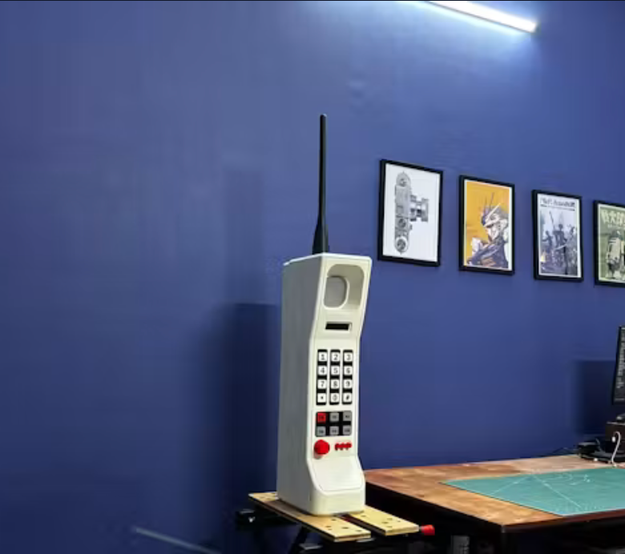

# Hi there, I'm Arnov! 👋

  

### 🖥️ Active System Profile
- **Role**: Software Developer & Tech Enthusiast
- **Location**: India
- **System Status**: Online & Active
- **Cognitive Modifiers**:
  - `[+] Well Coded` (+10% Programming Efficiency)
  - `[+] Hardware Sync` (+1 Electronics Skill)

---

## 🔥 Giant Replicas & Major Builds

Here are some of my custom-engineered, scaled-up replicas and portable computing devices built completely from scratch:

| [ **Motorola DynaTAC MAX**](https://www.hackster.io/Arnov_Sharma_makes/motorola-dynatac-max-e10b5b) | [ **iBrick (Giant iPod)**](https://www.hackster.io/Arnov_Sharma_makes/ibrick-04341c) |
| :---: | :---: |
| A Motorola DynaTAC-themed Soundboard-Bluetooth Speaker made from scratch, powered by PICO W. | An IPOD NANO 3rd Gen-inspired giant iPod powered by Raspberry Pi CM5 and a custom 3D-printed shell. |

| [ **DURACELL Max**](https://www.hackster.io/Arnov_Sharma_makes/duracell-max-97215b) | [ **Absolute LINUX TAB**](https://www.hackster.io/Arnov_Sharma_makes/absolute-linux-tab-f4e582) |
| :---: | :---: |
| What started as a regular AA battery turned into a 470Wh giant Duracell built completely from scratch. | Made a Raspberry Pi CM5-based tablet that runs pretty much everything we throw at it. |

---

## 🛠️ Featured Microcontroller Projects & Gadgets

Explore some of my custom-designed electronics, IoT gadgets, and astromech desk companions:

| [ **StackFM**](https://www.hackster.io/Arnov_Sharma_makes/stackfm-4f4cb0) | [ **SolMate 2.0**](https://www.hackster.io/Arnov_Sharma_makes/solmate-2-0-9ea4c5) |
| :---: | :---: |
| A tiny Wi-Fi radio built using the M5Stack AtomS3, a custom control webpage, a MAX98357A amplifier, and a speaker. | The updated version of my previously created SolMate, a portable solar power bank. |

| [ **PolyShot Camera**](https://www.hackster.io/Arnov_Sharma_makes/polyshot-point-and-shoot-camera-9dfa62) | [ **Stationery Unit D2**](https://www.hackster.io/Arnov_Sharma_makes/stationery-unit-d2-1e7b8b) |
| :---: | :---: |
| An open-source point-and-shoot camera I built from scratch. | It's an Interactive R2-D2 desk assistant, powered by ESP32 P4, and serves as an astromech companion that plays custom GIFs via a web app. |

---

## 📁 Complete Projects Inventory

Here is the complete inventory of all my hardware, firmware, and DIY projects, listed from newest to oldest:

<b>Click to expand full list of 392 projects</b>

- `[001]` **[LCD I2C Tutorial](https://www.hackster.io/Arnov_Sharma_makes/lcd-i2c-tutorial-664e5a)** - *Learn how to use an LCD with I2C ASAP.*
- `[002]` **[Ultrasonic Sensor with LCD I2C](https://www.hackster.io/Arnov_Sharma_makes/ultrasonic-sensor-with-lcd-i2c-dc16e9)** - *Displaying distance measured by ultrasonic sensor on liquid crystal display with I2C.*
- `[003]` **[0.96 inch OLED Getting Started Guide](https://www.hackster.io/Arnov_Sharma_makes/0-96-inch-oled-getting-started-guide-78163a)** - *0.96 inch OLED Getting Started Guide for beginners*
- `[004]` **[Setting up GRBL on Arduino UNO along CNCJS](https://www.hackster.io/Arnov_Sharma_makes/setting-up-grbl-on-arduino-uno-along-cncjs-dc02d9)** - *GRBL and CNCJS Tutorial*
- `[005]` **[U-Blox NEO-6M GPS Module Tutorial](https://www.hackster.io/Arnov_Sharma_makes/u-blox-neo-6m-gps-module-tutorial-0753d9)** - *Simple tutorial for u-blox's NEO-6M GPS module to find your current latitude and longitude.*
- `[006]` **[Raspberry Pi 1000](https://www.hackster.io/Arnov_Sharma_makes/raspberry-pi-1000-6b8710)** - *Raspberry Pi 5-based all-in-one PC inside a keyboard!*
- `[007]` **[NeoPixel x Arduino x Button](https://www.hackster.io/Arnov_Sharma_makes/neopixel-x-arduino-x-button-c26e9a)** - *A simple button cycler which changes the colour/animation of NeoPixel on a press of a button.*
- `[008]` **[Programming ATTINY84](https://www.hackster.io/Arnov_Sharma_makes/programming-attiny84-088482)** - *Just a tutorial on how to program Attiny84 (SMD Version) with Arduino as ICSP.*
- `[009]` **[DIY Arduino Remote for TV](https://www.hackster.io/Arnov_Sharma_makes/diy-arduino-remote-for-tv-619d59)** - *Made a TV Remote from Arduino nano, Pretty basic but functional*
- `[010]` **[Learn How to Program ATtiny85 and ATtiny13A](https://www.hackster.io/Arnov_Sharma_makes/learn-how-to-program-attiny85-and-attiny13a-167359)** - *A simple tutorial on programming ATtiny microcontrollers with an Arduino Uno.*
- `[011]` **[Music Reactive LED Strip with Microphone Module](https://www.hackster.io/Arnov_Sharma_makes/music-reactive-led-strip-with-microphone-module-f0f7c6)** - *LED strip turns on/off at a very fast rate which creates this visualizer effect when the microphone module picks up h...*
- `[012]` **[Arduino Game Controller](https://www.hackster.io/361085/arduino-game-controller-f3ffec)** - *DIY game controller project with a Pro Micro which uses an ATmega32U4 microcontroller for emulating a game controller.*
- `[013]` **[NRF24 Hookup Guide](https://www.hackster.io/Arnov_Sharma_makes/nrf24-hookup-guide-97b240)** - *"how to hook NRF24 Modules with an Arduino Correctly without killing the module"*
- `[014]` **[GPS + Bluetooth + Android](https://www.hackster.io/Arnov_Sharma_makes/gps-bluetooth-android-c3a90e)** - *I took an HC-05 and added it to my handheld GPS device to get coordinates on my Android tablet.*
- `[015]` **[3D-Printed Jet Turbine](https://www.hackster.io/Arnov_Sharma_makes/3d-printed-jet-turbine-02640c)** - *It's a BLDC motor based jet turbine.*
- `[016]` **[Simple Home Automation with Bluetooth and Relay](https://www.hackster.io/Arnov_Sharma_makes/simple-home-automation-with-bluetooth-and-relay-8428fa)** - *A Proper HOME AUTOMATION BOARD with 5V 2A Power supply and SMT BT Module*
- `[017]` **[L293D with ESP32 (Wemos Lolin D32 V2) Hacked Edition](https://www.hackster.io/Arnov_Sharma_makes/l293d-with-esp32-wemos-lolin-d32-v2-hacked-edition-ea2086)** - *Just a Tutorial on using L293D with an ESP32 MCU with a Twist/Hack*
- `[018]` **[HID Volume Knob with Pro Micro](https://www.hackster.io/Arnov_Sharma_makes/hid-volume-knob-with-pro-micro-db0bf8)** - *Just another Pro micro Volume Knob Setup with POTENTIOMETER*
- `[019]` **[Displaying your own photo on OLED display](https://www.hackster.io/Arnov_Sharma_makes/displaying-your-own-photo-on-oled-display-5a8e8b)** - *Learn how to display your image on 0.96" OLED screen.*
- `[020]` **[Getting Started with ILI9255 TFT LCD](https://www.hackster.io/Arnov_Sharma_makes/getting-started-with-ili9255-tft-lcd-378331)** - *A short tutorial on running an ILI9225 Display with your Arduino Board*
- `[021]` **[WS2812B RGB LED in Circuits](https://www.hackster.io/Arnov_Sharma_makes/ws2812b-rgb-led-in-circuits-7cb39e)** - *Learn how to use WS2812B RGB LED in custom circuits*
- `[022]` **[Simple Arduino Piano](https://www.hackster.io/Arnov_Sharma_makes/simple-arduino-piano-4e51d7)** - *A simple yet functional button based MIDI piano.*
- `[023]` **[Arduino Game Controller V2](https://www.hackster.io/Arnov_Sharma_makes/arduino-game-controller-v2-15ee8c)** - *Gamepad Made from Arduino Pro Micro and Custom PCB to play all types of games, from Retro to triple-A titles.*
- `[024]` **[Dual Axis Servo Control with Joystick](https://www.hackster.io/Arnov_Sharma_makes/dual-axis-servo-control-with-joystick-541162)** - *Controlling two servos with a joystick (which was taken out from an old USB controller).*
- `[025]` **[Chunchunmaru](https://www.hackster.io/Arnov_Sharma_makes/chunchunmaru-4f8c84)** - *Chunchunmaru is an Arduino UNO-based robot which can carry heavy loads (100kg-200kg) from one location to another.*
- `[026]` **[Line Following Robot](https://www.hackster.io/Arnov_Sharma_makes/line-following-robot-a79023)** - *line following robot setup using an L298N motor driver with an Arduino and two proximity sensor modules.*
- `[027]` **[3D-Printed Nanoleaf ATtiny85](https://www.hackster.io/Arnov_Sharma_makes/3d-printed-nanoleaf-attiny85-cb653d)** - *A cheap DIY version of Nanoleaf RGB LIGHT with ATtiny85 and WS2812 RGB strip.*
- `[028]` **["UVC Box" a DIY UV Sterilizer](https://www.hackster.io/Arnov_Sharma_makes/uvc-box-a-diy-uv-sterilizer-f09b8f)** - *A low cost easy to re-make UVC Sterilizer for sterilizing medical equipment and stuff.*
- `[029]` **[Arduino Helicopter (Crap Edition)](https://www.hackster.io/Arnov_Sharma_makes/arduino-helicopter-crap-edition-90d414)** - *I tried to make an Arduino helicopter which can be controlled via smartphone with Bluetooth.*
- `[030]` **[Ike, the Liquid Crystal Display Robo](https://www.hackster.io/Arnov_Sharma_makes/ike-the-liquid-crystal-display-robo-36cb6b)** - *With zero's, o's and few dashes, we can animate an LCD to make a retro-ish face that has blinking eyes and stuff.*
- `[031]` **[PIR Motion Activated LED](https://www.hackster.io/Arnov_Sharma_makes/pir-motion-activated-led-284eda)** - *A tutorial on how to make a passive infrared based motion LED.*
- `[032]` **[DIY NanoLEAF](https://www.hackster.io/Arnov_Sharma_makes/diy-nanoleaf-a98c95)** - *Made a twist on good old Nanoleaf project with WS2812B RGB LEDs and Attiny85!*
- `[033]` **[ATtiny85 with HC-05 Bluetooth Module](https://www.hackster.io/Arnov_Sharma_makes/attiny85-with-hc-05-bluetooth-module-a36028)** - *A simple tutorial on connecting the low-cost ATtiny85 with a Bluetooth module to toggle load.*
- `[034]` **[3D-Printed Arduino Obstacle Avoiding Robot](https://www.hackster.io/Arnov_Sharma_makes/3d-printed-arduino-obstacle-avoiding-robot-661aa6)** - *A simple obstacle avoiding robot with 3D-printed and salvaged parts.*
- `[035]` **[ESP12F Standalone Circuit!](https://www.hackster.io/Arnov_Sharma_makes/esp12f-standalone-circuit-1de4a7)** - *Learn how to Implement ESP12F esp8266 based module in your PCB projects (ESP12F minimal setup and Its Programming)*
- `[036]` **[Flux Capacitor PCB Badge](https://www.hackster.io/Arnov_Sharma_makes/flux-capacitor-pcb-badge-2b77eb)** - *Great Scott! It's a Flux Capacitor powered by an ATtiny85.*
- `[037]` **[A Better Arduino Synth with PAM8403 Audio Amplifier](https://www.hackster.io/Arnov_Sharma_makes/a-better-arduino-synth-with-pam8403-audio-amplifier-f7561c)** - *Adding PAM8403 AMP Module to my previously made "Arduino Atari Punk Synth" in order to improve its sound quality!*
- `[038]` **[My Basic Coil Gun Setup](https://www.hackster.io/Arnov_Sharma_makes/my-basic-coil-gun-setup-ca4da4)** - *Here's my minimal setup of a coilgun which uses a relay module to trigger the coil.*
- `[039]` **[Arduino Based NRF24 Transmitter-Receiver Setup](https://www.hackster.io/Arnov_Sharma_makes/arduino-based-nrf24-transmitter-receiver-setup-d73279)** - *PCB Version of NRF24 Arduino Based Transmitter and Reciever*
- `[040]` **[Arduino Game JUMP or DIE I2C](https://www.hackster.io/Arnov_Sharma_makes/arduino-game-jump-or-die-i2c-2c9f5a)** - *An Arduino LCD game based on I2C LCD.*
- `[041]` **[ESP32 CAM WEB Server and Getting Started Guide](https://www.hackster.io/Arnov_Sharma_makes/esp32-cam-web-server-and-getting-started-guide-f1a04a)** - *Setting up the ESP32 CAM for making a Security Camera (Level 1 )*
- `[042]` **[Absolute LINUX TAB](https://www.hackster.io/Arnov_Sharma_makes/absolute-linux-tab-f4e582)** - *Made a Raspberry Pi CM5-based tablet that runs pretty much everything we throw at it.*
- `[043]` **[NRF24 Based Drone Setup](https://www.hackster.io/364386/nrf24-based-drone-setup-ae1b4e)** - *Just another "DRONE PROJECT" with a custom Transmitter and Reciever setup based on Arduino Nano and NRF24L01 Module*
- `[044]` **[LED Tower](https://www.hackster.io/Arnov_Sharma_makes/led-tower-d54834)** - *Made a LED tower with 180 LEDs and used Pro Micro in order to control them in sequence.*
- `[045]` **[SMD LED Hacked!](https://www.hackster.io/Arnov_Sharma_makes/smd-led-hacked-274a8d)** - *I soldered SMD LED directly to wire and made them into THT LED, then used an Arduino to fade them.*
- `[046]` **[Capacitive Touch Arduino WITHOUT using TTP223 sensor](https://www.hackster.io/Arnov_Sharma_makes/capacitive-touch-arduino-without-using-ttp223-sensor-c8e197)** - *Turn an LED high or low with your body capacitance. (with simple RC circuit)*
- `[047]` **[Pi Box](https://www.hackster.io/Arnov_Sharma_makes/pi-box-c5d8fd)** - *Pi Box is an all-in-one Raspberry Pi 4 setup combined with a MIPI 5-inch display and onboard power source.*
- `[048]` **[Temperature Meter/Thermometer with NTC and OLED Display](https://www.hackster.io/Arnov_Sharma_makes/temperature-meter-thermometer-with-ntc-and-oled-display-83faa7)** - *Yet another temperature monitoring setup with NTC, SSD1306 OLED and NodeMCU*
- `[049]` **[Portable Air Quality Meter](https://www.hackster.io/Arnov_Sharma_makes/portable-air-quality-meter-64d7c6)** - *Made a small handy air quality meter based around the MQ135 Air Quality sensor.*
- `[050]` **[Arduino Rotating Platform Based on NEMA17](https://www.hackster.io/Arnov_Sharma_makes/arduino-rotating-platform-based-on-nema17-caef58)** - *A NEMA 17 stepper motor based Rotating Platform for capturing fancy rotating videos.*
- `[051]` **[Multiple ATtiny85/13A Programmer](https://www.hackster.io/Arnov_Sharma_makes/multiple-attiny85-13a-programmer-84adf8)** - *Program 6 ATtiny85/13A at the same time with this custom programmer board.*
- `[052]` **[Oximeter with MAX30100 Heart Rate Sensor and ESP32](https://www.hackster.io/Arnov_Sharma_makes/oximeter-with-max30100-heart-rate-sensor-and-esp32-bb0b27)** - *A simple Oximeter Setup powered by an ESP32*
- `[053]` **[Getting started with Attiny84](https://www.hackster.io/350166/getting-started-with-attiny84-c920ee)** - *learn how to program Attiny84 with this custom Breakout board with ams1117 for basic level projects like blinking LED...*
- `[054]` **[Clap Switch with Relay](https://www.hackster.io/Arnov_Sharma_makes/clap-switch-with-relay-cd8232)** - *Clap twice to turn ON or OFF the load which is connected to relay.*
- `[055]` **[Arduino as a Mouse](https://www.hackster.io/Arnov_Sharma_makes/arduino-as-a-mouse-bdb76f)** - *Control your mouse cursor with this simple Leonardo switch setup.*
- `[056]` **[ATBOY Minimal Retro Gaming Console](https://www.hackster.io/Arnov_Sharma_makes/atboy-minimal-retro-gaming-console-808bc1)** - *A small retro console-like setup based around ATtiny85 x 0.96 OLED for playing space invaders, Tetris, etc.*
- `[057]` **[Arduino Theremin](https://www.hackster.io/Arnov_Sharma_makes/arduino-theremin-96fc6d)** - *Arduino Based Theremin with MOZZI Library and LDR*
- `[058]` **[Powering an Arduino with AC source](https://www.hackster.io/Arnov_Sharma_makes/powering-an-arduino-with-ac-source-f939cd)** - **Powering an Arduino with Capacitor Dropper Circuit**
- `[059]` **[3D Printed Jet Turbine V2](https://www.hackster.io/Arnov_Sharma_makes/3d-printed-jet-turbine-v2-1dfc31)** - *Version 2 of My Previous 3D Printed Jet Turbine Project!*
- `[060]` **[Minimal Arduino Uno](https://www.hackster.io/Arnov_Sharma_makes/minimal-arduino-uno-7a3f23)** - *ATmega328P standalone/minimal setup.*
- `[061]` **[PastePal](https://www.hackster.io/Arnov_Sharma_makes/pastepal-af86a9)** - *A simple two-button macropad for copy and paste commands, we have added a display that outputs the keypress.*
- `[062]` **[ESP32 x L293D Motor Board](https://www.hackster.io/Arnov_Sharma_makes/esp32-x-l293d-motor-board-a9a7af)** - *The goal here was to make a High Power DC Motor driver with 4 L293D connected in parallel so it can provide 4A of cur...*
- `[063]` **[VAULT-TEC Air Terminal](https://www.hackster.io/Arnov_Sharma_makes/vault-tec-air-terminal-b479cb)** - *Made a Terminal PC from fallout, powered by Raspberry Pi 5*
- `[064]` **[Arduino-Based Butler Robot](https://www.hackster.io/Arnov_Sharma_makes/arduino-based-butler-robot-1f34b2)** - *It's an Arduino-based robot which brings food from the kitchen to my room.*
- `[065]` **[Arduino Soap/Sanitizer Dispenser (overkill version)](https://www.hackster.io/Arnov_Sharma_makes/arduino-soap-sanitizer-dispenser-overkill-version-75f5b4)** - *Basically an overkill soap dispenser made from CNC linear rail*
- `[066]` **[ESP32 and Round OLED Smart Watch Concept](https://www.hackster.io/Arnov_Sharma_makes/esp32-and-round-oled-smart-watch-concept-3a5601)** - *Prepared a smartwatch by using a round OLED Display and ESP32 Board.*
- `[067]` **[WEB Controlled RGB LED with NodeMCU](https://www.hackster.io/Arnov_Sharma_makes/web-controlled-rgb-led-with-nodemcu-7c87a9)** - *Noepixel with WEB Server on NodeMCU*
- `[068]` **[Custom 16x16 WS2812 Mini Matrix Project](https://www.hackster.io/Arnov_Sharma_makes/custom-16x16-ws2812-mini-matrix-project-516e1d)** - *Made a custom Matrix board that can be controlled via any MCU.*
- `[069]` **[Just Another ATtiny85 Retro Gaming Console](https://www.hackster.io/Arnov_Sharma_makes/just-another-attiny85-retro-gaming-console-d68205)** - *A small retro Console-like setup based around ATtiny85 x 0.96 OLED for playing space invaders, Tetris, etc.*
- `[070]` **[DIY Bench Power Supply](https://www.hackster.io/Arnov_Sharma_makes/diy-bench-power-supply-6f32d3)** - *Made a bench PSU from scratch using the ZK-4KX DC-DC Buck Boost module and a 3D-printed body.*
- `[071]` **[Arduino Atari Punk Synth](https://www.hackster.io/Arnov_Sharma_makes/arduino-atari-punk-synth-2934e8)** - *A DIY version of Atari Punk Synth with minimal stuff.*
- `[072]` **[Mini Matrix](https://www.hackster.io/Arnov_Sharma_makes/mini-matrix-493a70)** - *Made a Tiny 8x8 Matrix by using WS2812 2020 package LED.*
- `[073]` **[Linear Rail for CNC](https://www.hackster.io/Arnov_Sharma_makes/linear-rail-for-cnc-92e3b5)** - *A customizable Linear rail for CNC Z-Axis.*
- `[074]` **[Yet Another Solenoid Valve Based SANITIZER DISPENSER](https://www.hackster.io/Arnov_Sharma_makes/yet-another-solenoid-valve-based-sanitizer-dispenser-ecec7a)** - *3D Printed and easy to Replicate "Fluid Dispenser for alcohol-based sanitizer".*
- `[075]` **[DIY HexaLeaf with Attiny85](https://www.hackster.io/Arnov_Sharma_makes/diy-hexaleaf-with-attiny85-e5f048)** - *HexaLeaf Setup made from combining 6 Custom WS2812B PCB together*
- `[076]` **[PCB Hotplate Mini Edition](https://www.hackster.io/Arnov_Sharma_makes/pcb-hotplate-mini-edition-b9cf84)** - *Made an SMT hotplate completely from FR4 PCB.*
- `[077]` **[ESPCAM- XIAO Powered DIY Camera](https://www.hackster.io/Arnov_Sharma_makes/espcam-xiao-powered-diy-camera-1e93d1)** - *Made a DIY camera using the XIAO ESP32S4 Sense and a round OLED screen.*
- `[078]` **[Dimmable MOSFET LAMP](https://www.hackster.io/Arnov_Sharma_makes/dimmable-mosfet-lamp-36a225)** - *Learn how to create a Dimmable LED lamp with and without a microcontroller.*
- `[079]` **[Yet another Arduino self balancing robot](https://www.hackster.io/Arnov_Sharma_makes/yet-another-arduino-self-balancing-robot-00a2a0)** - *Made a Self Balancing Robot with 3D Printed parts and MPU6050*
- `[080]` **[GROW, the Opensource Soil Meter Project](https://www.hackster.io/Arnov_Sharma_makes/grow-the-opensource-soil-meter-project-a6d7c2)** - *Made a custom Handy soil meter that we can carry around for measuring soil moisture level.*
- `[081]` **[NeoPixel RGB Mixinator](https://www.hackster.io/Arnov_Sharma_makes/neopixel-rgb-mixinator-371edb)** - *NeoPixel ring based RGB color mixer.*
- `[082]` **[Simple 3D-Printed WS2812-Based RGB Lamp](https://www.hackster.io/Arnov_Sharma_makes/simple-3d-printed-ws2812-based-rgb-lamp-f72432)** - *Learn how to make a 3D-printed RGB lamp using a WS2812 LED strip.*
- `[083]` **[DIY Security CAM](https://www.hackster.io/Arnov_Sharma_makes/diy-security-cam-55649f)** - *A DIY Security Cam made from ESP32 and powered directly by AC240V (there's a charger circuit in it which converts 240...*
- `[084]` **[Nanoleaf 2.0](https://www.hackster.io/Arnov_Sharma_makes/nanoleaf-2-0-8e2c22)** - *Made a V2 of my previous Nanoleaf project with a few significant tweaks*
- `[085]` **[LED Tower V2](https://www.hackster.io/Arnov_Sharma_makes/led-tower-v2-3373dd)** - *LED Tower Made from stacking PCBs in a ROW, the whole setup is controlled by an Arduino nano.*
- `[086]` **[Mini Self-balancing Robot](https://www.hackster.io/Arnov_Sharma_makes/mini-self-balancing-robot-64eec8)** - *Made a simple Self Balancing Robot using XIAO ESP32 C3, Arduino Nano and Custom PCBs*
- `[087]` **[MicroBot V1 ESP32 Robot](https://www.hackster.io/Arnov_Sharma_makes/microbot-v1-esp32-robot-0c05d3)** - *Micro Gear Motor based small robot powered by a Wemos D32 Pro and controlled by Blynk app.*
- `[088]` **[Music Reactive LED Strip with Microphone Module V2](https://www.hackster.io/Arnov_Sharma_makes/music-reactive-led-strip-with-microphone-module-v2-70e682)** - *"Attiny85 based Music Reactive LED strip setup"*
- `[089]` **[WALKPi PCB Version](https://www.hackster.io/Arnov_Sharma_makes/walkpi-pcb-version-03f5ed)** - *Audio Player Project Powered by Pico 2 and DF Mini Player*
- `[090]` **[Simple HC05 robot](https://www.hackster.io/Arnov_Sharma_makes/simple-hc05-robot-06ddca)** - *Create a minimal robot setup with L298N motor driver and HC-05 Bluetooth module.*
- `[091]` **[Arduino Synth V3](https://www.hackster.io/Arnov_Sharma_makes/arduino-synth-v3-8dc6d4)** - *A simple Arduino-based synth that can generate all sorts of exciting sounds.*
- `[092]` **[Program ESP8266 with NodeMCU](https://www.hackster.io/Arnov_Sharma_makes/program-esp8266-with-nodemcu-7ea1bb)** - *Programming ESP12F Module with NodeMCU without using "FTDI with Flash and reset button method"*
- `[093]` **[Goku PCB Badge](https://www.hackster.io/413148/goku-pcb-badge-f26f11)** - *Made a PCB badge of our beloved hero Goku, LEDs sequence will look like Kamehameha in this badge.*
- `[094]` **[Programming ESP12F with an ESP8266 NodeMCU, the easy way](https://www.hackster.io/Arnov_Sharma_makes/programming-esp12f-with-an-esp8266-nodemcu-the-easy-way-fb0ceb)** - *Learn how to program an esp12F with an esp8266 nodemcu board without adding buttons to reset and put it into flash mode.*
- `[095]` **[Pi NAS](https://www.hackster.io/Arnov_Sharma_makes/pi-nas-40d470)** - *Pi 5-based NAS with Waveshare 4-channel NVMe board*
- `[096]` **[DIY SMT Hotplate Project](https://www.hackster.io/Arnov_Sharma_makes/diy-smt-hotplate-project-8157a5)** - *Minimal SMT Hotplate from Cloth Iron's Element, OLED Displays the temperature of Iron via a 10K thermistor, pretty si...*
- `[097]` **[Dodecagon Portal Project](https://www.hackster.io/Arnov_Sharma_makes/dodecagon-portal-project-9ae910)** - *A huge Nanoleaf like device made from soldering 12 PCBs each contains 7 WS2812B LEDs and anESP12F*
- `[098]` **[Massive Seven-Segment Display](https://www.hackster.io/Arnov_Sharma_makes/massive-seven-segment-display-33a23d)** - *Learn how to build this massive seven-segment display with seven LEDs and cardboard.*
- `[099]` **[TTGO Internet Watch](https://www.hackster.io/Arnov_Sharma_makes/ttgo-internet-watch-8badf2)** - *Yet another Internet clock for ESP32 which displays the current time on TTGO's Display.*
- `[100]` **[DIY Thermometer with TTGO T Display and DS18B20](https://www.hackster.io/Arnov_Sharma_makes/diy-thermometer-with-ttgo-t-display-and-ds18b20-2bca27)** - *Made a custom 3D Printed Thrmeometer from Scratch using TTGO T Display and DS18B20 Sensor.*
- `[101]` **[Getting started with THUNDERBOARD SENSE 2](https://www.hackster.io/Arnov_Sharma_makes/getting-started-with-thunderboard-sense-2-c06143)** - *Getting familiar with Silicon Lab's Thunderboard sense 2 Dev platform*
- `[102]` **[Raspberry Pi Pico as HID Mouse](https://www.hackster.io/Arnov_Sharma_makes/raspberry-pi-pico-as-hid-mouse-370827)** - *Using RPI Pico with an custom expansion board for testing HID functionality of Pico*
- `[103]` **[QuasarQ](https://www.hackster.io/Arnov_Sharma_makes/quasarq-3b0903)** - *An ESP32 Powered Space-Themed Interactive Quiz Console*
- `[104]` **[PathFinder](https://www.hackster.io/Arnov_Sharma_makes/pathfinder-fedd65)** - *PathFinder is a wearable, portable device that stores a map of my hometown, which can be viewed and navigated using D...*
- `[105]` **[TTP23 Touchpad Switch](https://www.hackster.io/Arnov_Sharma_makes/ttp23-touchpad-switch-be68a1)** - *A simple setup for LED toggle via TouchPad sensor TTP223.*
- `[106]` **[MAC Pi](https://www.hackster.io/Arnov_Sharma_makes/mac-pi-a48047)** - *MAC Looking CM5 Enclosure made from Scratch*
- `[107]` **[HitPad](https://www.hackster.io/Arnov_Sharma_makes/hitpad-6182e1)** - *Portable Tiny-Music Maker based around M5ATOM and a custom enclosure.*
- `[108]` **[Atari Punk Synth V2](https://www.hackster.io/Arnov_Sharma_makes/atari-punk-synth-v2-8b9dd3)** - *Version 2 of my previous Atari Punk Synth project powered by a Minimal ATmega328-PU config and Mozzi library.*
- `[109]` **[Pico Drum Machine](https://www.hackster.io/Arnov_Sharma_makes/pico-drum-machine-1fcba3)** - *Pico 2 powered drum machine that plays notes stored in SD card through the DFMiniPlayer.*
- `[110]` **[Relay Module Basics](https://www.hackster.io/Arnov_Sharma_makes/relay-module-basics-52e798)** - *Learn how to control a relay module LIKE A BOSS to do a little home automation.*
- `[111]` **[PICO Studio Light](https://www.hackster.io/Arnov_Sharma_makes/pico-studio-light-4eac11)** - *Made a studio light that has warm, cool, and RGB LEDs all driven through a custom PICO driver circuit.*
- `[112]` **[LED Matrix PCB](https://www.hackster.io/Arnov_Sharma_makes/led-matrix-pcb-d8b448)** - *A 3x3 matrix printed circuit board with SMD 0603 indicator LED.*
- `[113]` **[AMS1117 Voltage Regulation PCB](https://www.hackster.io/Arnov_Sharma_makes/ams1117-voltage-regulation-pcb-9569aa)** - *Making a PCB with AMS1117 for a drone project which required 3.3V VCC.*
- `[114]` **[XIAO ESP32 S3 Handheld Camera- Pocket Edition](https://www.hackster.io/Arnov_Sharma_makes/xiao-esp32-s3-handheld-camera-pocket-edition-9325f6)** - *Built a straightforward ESP32 S3 CAM Module-based device that takes pictures similarly to a point-and-shoot camera.*
- `[115]` **[PiP-WATCH Project](https://www.hackster.io/Arnov_Sharma_makes/pip-watch-project-370245)** - *Pipboy inspired watch from the Fallout game series.*
- `[116]` **[Flux Capacitor PCB badge V3](https://www.hackster.io/Arnov_Sharma_makes/flux-capacitor-pcb-badge-v3-acc045)** - *Made a new version of my FLUX CAPACITOR Project*
- `[117]` **[MatTris — Tetris on an LED Matrix](https://www.hackster.io/Arnov_Sharma_makes/mattris-tetris-on-an-led-matrix-7fc971)** - *Classic Tetris running on a custom WS2812 2020 LED-based matrix powered by RP2040*
- `[118]` **[DIY Portable Monitor](https://www.hackster.io/Arnov_Sharma_makes/diy-portable-monitor-b6bd24)** - *Made a Small Portable HDMI Monitor Featuring a 7-inch display and portable setup with inbuilt battery and HDMI connec...*
- `[119]` **[DIY Digital Watch Project](https://www.hackster.io/Arnov_Sharma_makes/diy-digital-watch-project-778ac8)** - *Made a simple Watch using XIAO ESP32C3 paired with XIAO Expansion board*
- `[120]` **[Dumb but Great Point and Shoot Camera with ESP32 CAM](https://www.hackster.io/Arnov_Sharma_makes/dumb-but-great-point-and-shoot-camera-with-esp32-cam-e54765)** - *A completely portable ESP32 Based Point and Shoot Camera setup that works, kinda works.*
- `[121]` **[XIAO ESP32 Home Automation Shield](https://www.hackster.io/Arnov_Sharma_makes/xiao-esp32-home-automation-shield-7c568e)** - *A dual relay-based home automation device for the ESP32 XIAO C3 and S3 with an onboard power supply so it can be powe...*
- `[122]` **[The Third Eye](https://www.hackster.io/Arnov_Sharma_makes/the-third-eye-0e6666)** - *Easy to make third eye setup made with a Round LCD powered by an ESP32 Board.*
- `[123]` **[Fume Extractor](https://www.hackster.io/Arnov_Sharma_makes/fume-extractor-5565b0)** - *Made a Fume Extractor by using a custom Attiny13 Based Motor driver board and 3D Printed Body,*
- `[124]` **[Makeshift DIY ARDUBOY](https://www.hackster.io/Arnov_Sharma_makes/makeshift-diy-arduboy-a0b33c)** - *Made an ARDUBOY Clone by editing a previously made PCB for a different project.*
- `[125]` **[RISC-V Mini PC](https://www.hackster.io/Arnov_Sharma_makes/risc-v-mini-pc-1e1ca5)** - *Made a Mini PC Powered by the StarFive's VisionFive 2*
- `[126]` **[LATTEintosh DIY Mini PC](https://www.hackster.io/Arnov_Sharma_makes/latteintosh-diy-mini-pc-81c70f)** - *LATTEintosh is a DIY PC Made entirely from scratch, Latte Panda 3 Delta is used here and it runs Windows 10!*
- `[127]` **[Gameboy XL](https://www.hackster.io/Arnov_Sharma_makes/gameboy-xl-bb64d3)** - *Large Version of Gameboy, powered by Raspberry Pi 5*
- `[128]` **[Snake Game Console](https://www.hackster.io/Arnov_Sharma_makes/snake-game-console-07b378)** - *A handheld game console based around the Raspberry Pi PICO 2 combined with the Waveshare RGB-Matrix-P3.*
- `[129]` **[Temperature Card](https://www.hackster.io/Arnov_Sharma_makes/temperature-card-e02b3a)** - *The Temperature Card is a wearable XIAO and SSD1306-based device that displays the current temperature using an SHT40...*
- `[130]` **[PCB Hotplate Slightly Bigger Edition](https://www.hackster.io/Arnov_Sharma_makes/pcb-hotplate-slightly-bigger-edition-6a8ed8)** - *Made V2 of my previously created PCB Mini Hotplate Project with a bigger reflow surface and XIAO Board*
- `[131]` **[Internet Clock with ESP8266](https://www.hackster.io/Arnov_Sharma_makes/internet-clock-with-esp8266-32ab03)** - *Made an Internet Clock from scratch using a custom ESP8266 Board.*
- `[132]` **[ROOM TEMP Meter with Arduino Nano and AHT10](https://www.hackster.io/Arnov_Sharma_makes/room-temp-meter-with-arduino-nano-and-aht10-a7263c)** - *A simple TEMP and Humidity Meter with simple Arduino Nano and SSD1306 with AHT10 Sensor.*
- `[133]` **[PICO Sequencer](https://www.hackster.io/Arnov_Sharma_makes/pico-sequencer-173a5f)** - *PICO Sequencer is a DIY version of the famous Pocket Operator Synth Sequencer Devices.*
- `[134]` **[PCB Etching Tutorial with Ferric Chloride](https://www.hackster.io/Arnov_Sharma_makes/pcb-etching-tutorial-with-ferric-chloride-19dd20)** - *A tutorial on this etching this ATtiny85 THT based PCB.*
- `[135]` **[Motor Driver Board Atmega328PU and HC01](https://www.hackster.io/Arnov_Sharma_makes/motor-driver-board-atmega328pu-and-hc01-68f9fb)** - *Made a Motor Driver Controller board powered by an Atmega328PU and an HC01 Module for Connectivity.*
- `[136]` **[PALPi Retro Game Console](https://www.hackster.io/Arnov_Sharma_makes/palpi-retro-game-console-4be5e4)** - *Raspberry Pi Zero Based Handheld Gaming Console. Display works on composite PAL hence the name PALPi*
- `[137]` **[XIAO Home Automation Board](https://www.hackster.io/Arnov_Sharma_makes/xiao-home-automation-board-4c0256)** - *Made a simple Home automation Board based around XIAO DEV Platform*
- `[138]` **[Portable Display V2](https://www.hackster.io/Arnov_Sharma_makes/portable-display-v2-1e0cf6)** - *A thinner version of the previously created protable display project.*
- `[139]` **[3D printed GearBox](https://www.hackster.io/Arnov_Sharma_makes/3d-printed-gearbox-3e42ab)** - *Made a Gearbox from scratch for an upcoming Kinetic Sculpture project*
- `[140]` **[Li-ion Cell Charger with TP4056 and XIAO ESP32S3](https://www.hackster.io/Arnov_Sharma_makes/li-ion-cell-charger-with-tp4056-and-xiao-esp32s3-7ee908)** - *Made a Li-ion 18650 Cell charger with onboard Voltage monitoring setup powered by XIAO ESP32S3 and SSD1306 Display*
- `[141]` **[SOLAR Bank!](https://www.hackster.io/Arnov_Sharma_makes/solar-bank-887a23)** - *Solar-powered power bank for powering Arduino or other 5V Operated things.*
- `[142]` **[POWER Pi Version 2](https://www.hackster.io/Arnov_Sharma_makes/power-pi-version-2-8446ef)** - *POWER Pi is an all-in-one Raspberry Pi PC project; the name comes from the built-in battery pack.*
- `[143]` **[IOTA STATION- A Mini PC with Giant Rotary Knob](https://www.hackster.io/Arnov_Sharma_makes/iota-station-a-mini-pc-with-giant-rotary-knob-cc6140)** - *A Mini PC powered by Lattepanda IOTA SBC*
- `[144]` **[Voronoi Diagram Based PCB Lamp](https://www.hackster.io/Arnov_Sharma_makes/voronoi-diagram-based-pcb-lamp-5f3d8a)** - *Made a PCB Box Lamp based around Voronoi shape. Voronoi if you don't know is a Mathematical anomaly found in nature.*
- `[145]` **[555 Timer Based Blinker](https://www.hackster.io/Arnov_Sharma_makes/555-timer-based-blinker-e44d94)** - *I made a simple 555 blinker circuit and added a MOSFET to control 12V LED strip with it.*
- `[146]` **[PALPi V5 Handheld Retro Game Console](https://www.hackster.io/Arnov_Sharma_makes/palpi-v5-handheld-retro-game-console-19d4a2)** - *PALPi is a Raspberry Pi Based Retro Game Console, it runs with Recalbox OS and has a PAL Display hence the name.*
- `[147]` **[Pi Box V2](https://www.hackster.io/Arnov_Sharma_makes/pi-box-v2-391d84)** - *Updated Version of the Pi Box which is an all-in-one Raspberry Pi 4 setup combined with a MIPI 5-inch display and onb...*
- `[148]` **[DESK LAMP with ESP12F and RGB LEDs](https://www.hackster.io/Arnov_Sharma_makes/desk-lamp-with-esp12f-and-rgb-leds-ced479)** - *Made a Designer Desk LAMP with custom 3D Printed Body and ESP12F Driven Circuit with addressable LEDs.*
- `[149]` **[Overengineered Fume Extractor Project](https://www.hackster.io/Arnov_Sharma_makes/overengineered-fume-extractor-project-1da466)** - *Made an Overengineered Fume Extractor from PCBs, Fan is controlled by Attiny13, this setup has an onboard battery for...*
- `[150]` **[PCB Hotplate V3](https://www.hackster.io/Arnov_Sharma_makes/pcb-hotplate-v3-2de7ee)** - *XIAO ESP32 C3 Powered PCB Hotplate*
- `[151]` **[PALPi Version 2, final edition](https://www.hackster.io/Arnov_Sharma_makes/palpi-version-2-final-edition-6c5cd1)** - *Made a Raspberry Pi Based Game controller with a Big Display and custom PCBs*
- `[152]` **[Home Automation Getting Started guide](https://www.hackster.io/Arnov_Sharma_makes/home-automation-getting-started-guide-7a8185)** - *Made a simple ESP8266 Based Home Automation Setup that controls 6 outputs via a WEB APP in the local network.*
- `[153]` **[Custom 16x8 Ws2812 Matrix Project](https://www.hackster.io/Arnov_Sharma_makes/custom-16x8-ws2812-matrix-project-89778d)** - *Made a custom Matrix board that can be controlled via any MCU.*
- `[154]` **[Manga Reader ESP8266](https://www.hackster.io/Arnov_Sharma_makes/manga-reader-esp8266-cbaf23)** - *Made a manga reader by using a custom ESP8266 board that uses an ILI9225 Display for showing comic panels.*
- `[155]` **[Custom 5x5 Keypad](https://www.hackster.io/Arnov_Sharma_makes/custom-5x5-keypad-70c845)** - *Made a 5x5 keypad Matrix from scratch.*
- `[156]` **[PCB Heart Necklace](https://www.hackster.io/Arnov_Sharma_makes/pcb-heart-necklace-7720ed)** - *Made a heart-shaped PCB Necklace for a special one <3*
- `[157]` **[VaderCam 1.0](https://www.hackster.io/Arnov_Sharma_makes/vadercam-1-0-9ab605)** - *VaderCam is a Nanny Cam based on ESP32 cam for keeping an eye for several things including kids, and even 3D printers.*
- `[158]` **[Arduino Game Controller for NES and GBA](https://www.hackster.io/Arnov_Sharma_makes/arduino-game-controller-for-nes-and-gba-84c89b)** - *Made a Simple Game Controller with Seeed's XIAO M0 DEV Board and 3D Printed body.*
- `[159]` **[Over Engineered TriGlow](https://www.hackster.io/Arnov_Sharma_makes/over-engineered-triglow-8afd6a)** - *TriaGlow is a Nanoleaf like setup but white. It's fully 3D Printed and controlled by a touchpad switch. (touch switch...*
- `[160]` **[Home Automation Board with NODEMCU Six Outputs](https://www.hackster.io/Arnov_Sharma_makes/home-automation-board-with-nodemcu-six-outputs-b75af4)** - *A NODEMCU based home automation board with six relays and an onboard AC SMPS for powering the device directly from an...*
- `[161]` **[Delta Nas Project](https://www.hackster.io/Arnov_Sharma_makes/delta-nas-project-b47817)** - *Made a Home Nas powered by LattePanda 3 Delta*
- `[162]` **[Pico VGA Board 1.0](https://www.hackster.io/Arnov_Sharma_makes/pico-vga-board-1-0-0c121c)** - *Drive VGA/HDMI Monitors with this Raspberry Pi PICO-based Dev board.*
- `[163]` **[DIY Handheld Fan](https://www.hackster.io/Arnov_Sharma_makes/diy-handheld-fan-c14901)** - *Made a DC Handheld Fan from scratch using 3D Printed parts and a custom PCB. An Attiny13A powers the whole setup.*
- `[164]` **[Diamond Shaped PCB Necklace](https://www.hackster.io/Arnov_Sharma_makes/diamond-shaped-pcb-necklace-a8dd51)** - *Made a PCB Necklace by using an Attiny13 and a Diamond Shaped PCB*
- `[165]` **[Web Controlled Desk Lamp with XIAO ESP32 C3](https://www.hackster.io/Arnov_Sharma_makes/web-controlled-desk-lamp-with-xiao-esp32-c3-ef6f3c)** - *Made a simple Desk LED Lamp made completely out of PCBs, powered by XIAO ESP32 C3*
- `[166]` **[Pocket SNES](https://www.hackster.io/Arnov_Sharma_makes/pocket-snes-9babf9)** - *Miniature version of the Classic SNES Controller.*
- `[167]` **[Freeform Button and LED ON OFF tutorial](https://www.hackster.io/Arnov_Sharma_makes/freeform-button-and-led-on-off-tutorial-84b1e7)** - *It's a tutorial but with freeform circuitry components.*
- `[168]` **[Motorola DynaTAC MAX](https://www.hackster.io/Arnov_Sharma_makes/motorola-dynatac-max-e10b5b)** - *A Motorola DynaTAC-themed Soundboard-Bluetooth Speaker made from scratch, powered by PICO W.*
- `[169]` **[ILI9341 Display and LOLIN D32 Carrier Board](https://www.hackster.io/Arnov_Sharma_makes/ili9341-display-and-lolin-d32-carrier-board-d36e2e)** - *Carrier Board for ili9341 and Lolin D32 Board*
- `[170]` **[Pico Macropad](https://www.hackster.io/Arnov_Sharma_makes/pico-macropad-6bb29e)** - *Made a Macropad using Raspberry Pi RP2040 and custom PCB*
- `[171]` **[Pocket Synth V1](https://www.hackster.io/Arnov_Sharma_makes/pocket-synth-v1-b30fc1)** - *Made a Small Handy Mini Synth powered by XIAO ESP32 S3 Microcontroller*
- `[172]` **[Cyber. PY Zero-One](https://www.hackster.io/Arnov_Sharma_makes/cyber-py-zero-one-339846)** - *CYBER. PY is a compact Raspberry Pi-powered mini PC-CYBERDESK made from a 7-inch LCD display connected to an RPI 4B+ ...*
- `[173]` **[PICO TEMPERATURE GUN Version 1](https://www.hackster.io/Arnov_Sharma_makes/pico-temperature-gun-version-1-9e03f7)** - *Raspberry Pi PICO 2 Powered TEMP GUN based around the GY-906 Infrared Temp Module.*
- `[174]` **[DIY LM317 Based Buck Converter](https://www.hackster.io/Arnov_Sharma_makes/diy-lm317-based-buck-converter-e3eae6)** - *Made a super small Buck converter module based around LM317 that can provide a stable 5V for powering XYZ electronics.*
- `[175]` **[Interactive RGB Eyes](https://www.hackster.io/Arnov_Sharma_makes/interactive-rgb-eyes-6081a7)** - *It's a pair of mood light-ish eyes which can change color according to sensor value or battery status of setup.*
- `[176]` **[Neko Punk Synth V2](https://www.hackster.io/Arnov_Sharma_makes/neko-punk-synth-v2-d06f3e)** - *Made a Cat themed Synth with an Arduino Nano and Mozzi Library*
- `[177]` **[PokePi Game Console](https://www.hackster.io/Arnov_Sharma_makes/pokepi-game-console-801d53)** - *Pokémon Themed Game Console powered by the Raspberry Pi Zero W for emulation of old Pokémon games.*
- `[178]` **[H Bridge for Micro Motors](https://www.hackster.io/Arnov_Sharma_makes/h-bridge-for-micro-motors-c27056)** - *Made an H bridge with Transistors and Mosfets for driving Micro Gear Motor that operates at less than 5V.*
- `[179]` **[Grove- Raspberry Pi Power Hat](https://www.hackster.io/Arnov_Sharma_makes/grove-raspberry-pi-power-hat-1f28d7)** - *A simple solution for using a Li-ion Cell to power a Raspberry Pi, Power Hat boosts 3.7V from Li-ion Cell to a Stable...*
- `[180]` **[WaveFORM : the Background Sound Visualizer](https://www.hackster.io/Arnov_Sharma_makes/waveform-the-background-sound-visualizer-9ec782)** - *Waveform is a small wall-mounted display that turns sound into moving waves.*
- `[181]` **[DIY Thermometer with TTGO T Display and DS18B20 V2](https://www.hackster.io/Arnov_Sharma_makes/diy-thermometer-with-ttgo-t-display-and-ds18b20-v2-2f210c)** - *Version 2 of a previously made Thermometer project.*
- `[182]` **["VOLTMASTER" the 5V Power Source](https://www.hackster.io/Arnov_Sharma_makes/voltmaster-the-5v-power-source-ab0679)** - *VOLTMASTER is a constant 5V power source which can be used to power a variety of 5V devices, including MCUs, SBCs and...*
- `[183]` **[SYNTHESIZER made from scratch](https://www.hackster.io/Arnov_Sharma_makes/synthesizer-made-from-scratch-ddc0a6)** - *Made a synthesizer with an minimal ATMEGA382PU setup and MOZZIE Library*
- `[184]` **[Candy Box Gameboy](https://www.hackster.io/Arnov_Sharma_makes/candy-box-gameboy-30e6b2)** - *The ATTBOY is a very basic Attiny85-based game console that is housed in a candy box and runs the space invaders game.*
- `[185]` **[Cyber. PY Zero-Two](https://www.hackster.io/Arnov_Sharma_makes/cyber-py-zero-two-fdd889)** - *CYBER. PY is a compact Raspberry Pi-powered mini PC-CYBERDESK made from a 7-inch LCD display connected to an RPI 4B+ ...*
- `[186]` **[Arduino Retro Game Controller](https://www.hackster.io/Arnov_Sharma_makes/arduino-retro-game-controller-7cdd0e)** - *Made a Simple game Controller based around Arduino Micro*
- `[187]` **[Smart Flashlight with XIAO MCU](https://www.hackster.io/Arnov_Sharma_makes/smart-flashlight-with-xiao-mcu-7deb28)** - *Made a smart Flashlight using XIAO Microcontroller paired with OLED Expansion Board.*
- `[188]` **[Transparent OLED Test Board with XIAO](https://www.hackster.io/Arnov_Sharma_makes/transparent-oled-test-board-with-xiao-7c762a)** - *A simple XIAO-Powered board for Transparent OLED Screen*
- `[189]` **[OverEngineered Pen Holder 2.0](https://www.hackster.io/Arnov_Sharma_makes/overengineered-pen-holder-2-0-5c0daf)** - *Made a new version of PEN Holder with few features*
- `[190]` **[Christmas Ornament made from PCB](https://www.hackster.io/Arnov_Sharma_makes/christmas-ornament-made-from-pcb-12533c)** - *Using a simple astable vibrator circuit, I made a glowing ornament for a Christmas tree decoration.*
- `[191]` **[PCB Necklace V1](https://www.hackster.io/Arnov_Sharma_makes/pcb-necklace-v1-3931be)** - *Made a wearable Small Necklace or pendant with custom Tear shaped PCB and Attiny13A*
- `[192]` **[Overengineered RGB Mask!](https://www.hackster.io/Arnov_Sharma_makes/overengineered-rgb-mask-7cf017)** - *Made a face mask with PCBs and added WS2812B LEDs with ESP8266 on it.*
- `[193]` **[Super Power Buck Converter](https://www.hackster.io/Arnov_Sharma_makes/super-power-buck-converter-0f424c)** - *Made a small PD 5V Buck Module for powering high-power devices like the Pi5, Latte Panda, etc. PD Output between 3V t...*
- `[194]` **[Yet Another Badge, A Ghost Badge made from 555 Timer IC](https://www.hackster.io/418992/yet-another-badge-a-ghost-badge-made-from-555-timer-ic-92dfbf)** - *well, what can I say, title explains everything, it's a 555 timer IC Based Blinky Board made from THT components.*
- `[195]` **[String Controller V1](https://www.hackster.io/Arnov_Sharma_makes/string-controller-v1-33dcfc)** - *A Game Controller that you can wear and operate by movement of fingers.*
- `[196]` **[RGB Glasses part 2](https://www.hackster.io/Arnov_Sharma_makes/rgb-glasses-part-2-8bf83a)** - *Made RGB Glasses entirely from FR4 PCB which is powered by an ESP12F Module.*
- `[197]` **[Smart Room Heater Plug](https://www.hackster.io/Arnov_Sharma_makes/smart-room-heater-plug-b0f7ad)** - *A WIFI PLUG Powered by XIAO ESP32 C3 DEV board and a CUSTOM AC RELAY DRIVER BOARD.*
- `[198]` **[Raspberry Pi Game Emulation Station](https://www.hackster.io/Arnov_Sharma_makes/raspberry-pi-game-emulation-station-115531)** - *A Built Guide about setting up Game Emulator on RPI.*
- `[199]` **[WALKPi Breadboard Version](https://www.hackster.io/Arnov_Sharma_makes/walkpi-breadboard-version-317c16)** - *WALKPi is a Raspberry Pi Pico powered Audio Player which uses the DFMini Player to play audio files stored on SD Card*
- `[200]` **[Mini DIY H-Bridge made from Fets](https://www.hackster.io/Arnov_Sharma_makes/mini-diy-h-bridge-made-from-fets-4376c4)** - *Made a simple H Bridge setup by using SMD Mosfets, Arduino is used as control unit.*
- `[201]` **[PORTABLE Space Trash Game Console](https://www.hackster.io/Arnov_Sharma_makes/portable-space-trash-game-console-cb5d49)** - *I made a handheld game console that runs OG SPACE TRASH GAME using an XIAO expansion board.*
- `[202]` **[Christmas Tree with 555 Timer and CD4017 Decade Counter IC](https://www.hackster.io/Arnov_Sharma_makes/christmas-tree-with-555-timer-and-cd4017-decade-counter-ic-068a7d)** - *Yet another Blinky Board Themed after Christmas Tree and powered by 555 Timer and CD4017 Decade counter IC.*
- `[203]` **[SEEED STUDIO themed PCB Keychain](https://www.hackster.io/Arnov_Sharma_makes/seeed-studio-themed-pcb-keychain-b04530)** - *Made a SEEED Studio Themed PCB Keychain with a few gimmicks in it.*
- `[204]` **[Obito Uchiha PCB Badge](https://www.hackster.io/Arnov_Sharma_makes/obito-uchiha-pcb-badge-6280b5)** - *Made a PCB Badge of my favorite character from Naruto Anime! Driven by an Attiny13A*
- `[205]` **[DIY Turntable Rotating Platform](https://www.hackster.io/Arnov_Sharma_makes/diy-turntable-rotating-platform-082c52)** - *Made a DIY version of Turntable using a Micro Motor controlled by an Attiny13A MCU.*
- `[206]` **[Yet another Glasses, RGB Glasses](https://www.hackster.io/Arnov_Sharma_makes/yet-another-glasses-rgb-glasses-20cbd6)** - *WS2812B LED embedded Glasses!*
- `[207]` **[Snake Game Console Mini](https://www.hackster.io/Arnov_Sharma_makes/snake-game-console-mini-7a2742)** - *Small Version of my previously created Snake Game Console Project*
- `[208]` **[PulpPro](https://www.hackster.io/Arnov_Sharma_makes/pulppro-14b55b)** - *Made a Paper Maché Machine from scratch using 3D-printed parts and a custom circuit.*
- `[209]` **[RGB Mixinator V2](https://www.hackster.io/Arnov_Sharma_makes/rgb-mixinator-v2-55965d)** - *DIY Color Mixer that uses an Arduino Nano with few WS2812B LEDs*
- `[210]` **[Wi-Fi Status Box](https://www.hackster.io/Arnov_Sharma_makes/wi-fi-status-box-f3d24f)** - *A Wi-Fi indicator that signals if the Internet is working or not.*
- `[211]` **[Voronoi PCB Lamp V2](https://www.hackster.io/Arnov_Sharma_makes/voronoi-pcb-lamp-v2-e3f1e1)** - *Did some modifications to the previous Voronoi Lamp Project*
- `[212]` **[CONE LAMP With XIAO](https://www.hackster.io/Arnov_Sharma_makes/cone-lamp-with-xiao-211fed)** - *Made a cone-shaped RGB Lamp from scratch, The lamp consists of WS2812 LEDs that are controlled by an XIAO MCU.*
- `[213]` **[Naruto Themed Night Lamp](https://www.hackster.io/Arnov_Sharma_makes/naruto-themed-night-lamp-a0f8e2)** - *Made a Naruto themed night lamp-based around ATtiny13A MCU and custom PCB.*
- `[214]` **[PALPi Lite Edition](https://www.hackster.io/Arnov_Sharma_makes/palpi-lite-edition-1bc66b)** - *Made yet another Raspberry Pi Based Retro Game Console*
- `[215]` **[OverEngineered Pen Holder](https://www.hackster.io/Arnov_Sharma_makes/overengineered-pen-holder-6a251e)** - *A Pen Holder made from PCBs and 3D Printed parts in an OverEnginnered Way.*
- `[216]` **[SSD1306 Cat Eyes GIF](https://www.hackster.io/Arnov_Sharma_makes/ssd1306-cat-eyes-gif-42b886)** - *A simple tutorial on how to use SSD1306 for displaying moving GIFs, in this case, cat eyes.*
- `[217]` **[Live TEMP Meter with XIAO and AHT10](https://www.hackster.io/Arnov_Sharma_makes/live-temp-meter-with-xiao-and-aht10-c482ea)** - *TEMP meter was created and installed on a motorcycle to show the temperature and humidity in real time in the vicinity.*
- `[218]` **[Transistor](https://www.hackster.io/Arnov_Sharma_makes/transistor-6ab430)** - *This is about transistors.*
- `[219]` **[ESP07 Dev Board from Scratch](https://www.hackster.io/Arnov_Sharma_makes/esp07-dev-board-from-scratch-14a22c)** - *I made a breadboard-friendly breakout board for the ESP07 board so it can be used for prototyping ESP8266-based proje...*
- `[220]` **[Home Automation Board with ESP8266 Dual Output](https://www.hackster.io/Arnov_Sharma_makes/home-automation-board-with-esp8266-dual-output-75f5b3)** - *I made a custom home automation board from scratch using the ESP07S module and other mandatory components.*
- `[221]` **[Micro Fighter BOT with Bluetooth](https://www.hackster.io/Arnov_Sharma_makes/micro-fighter-bot-with-bluetooth-911e33)** - *A small 4x4 Micro Motor Based Robot which is powered by an Arduino Nano and L293D, HC01 is used for control.*
- `[222]` **[Happy Week Indicator](https://www.hackster.io/Arnov_Sharma_makes/happy-week-indicator-f89c8a)** - *A PCB setup with serotonin graphics and a NeoPixel LED that glows red on weekdays and green on weekends.*
- `[223]` **[Snake Game Console MAX](https://www.hackster.io/Arnov_Sharma_makes/snake-game-console-max-f7ef8d)** - *An enlarged and updated version of the previously created Snake Game Console project*
- `[224]` **[BOXcilloscope](https://www.hackster.io/Arnov_Sharma_makes/boxcilloscope-b5cb4e)** - *An open source easy to make portable oscilloscope with an in-built battery.*
- `[225]` **[PALPi Version 2, Big Edition](https://www.hackster.io/Arnov_Sharma_makes/palpi-version-2-big-edition-ee6bcc)** - *Made a Raspberry Pi Based Game controller with a Big Display*
- `[226]` **[R2D2 Mini Edition](https://www.hackster.io/Arnov_Sharma_makes/r2d2-mini-edition-fa782e)** - *Made a miniature R2D2 from PCB, it's powered by an Attiny85 and speaks ASTROMECH Phrases at 3-second intervals throug...*
- `[227]` **[PALPi V6 Retro Game Emulation System](https://www.hackster.io/Arnov_Sharma_makes/palpi-v6-retro-game-emulation-system-7ebd8f)** - *PALPi is essentially a Raspberry Pi Zero W based Handheld Game emulation system.*
- `[228]` **[Pocket Temp Meter](https://www.hackster.io/Arnov_Sharma_makes/pocket-temp-meter-4b0119)** - *A small handy pocket TEMP Meter made from ESP32C3 driven MCU paired with an SSD1306 128x32-pixel screen, AHT10 is bei...*
- `[229]` **[Button Mouse with XIAO](https://www.hackster.io/Arnov_Sharma_makes/button-mouse-with-xiao-a1054d)** - *Made a simple button based mouse driven by XIAO M0 SAMD21 Based Dev board which supports HID*
- `[230]` **[SEGA Light Board](https://www.hackster.io/Arnov_Sharma_makes/sega-light-board-b3c04e)** - *Made a SEGA-themed LED Light Board powered by the OG Attiny85*
- `[231]` **[Wings of Freedom! PCB Badge](https://www.hackster.io/Arnov_Sharma_makes/wings-of-freedom-pcb-badge-5034d9)** - *ATTINY13A Powered PCB Badge project based on Attack on Titan*
- `[232]` **[64x32 Matrix Panel Setup with PICO 2](https://www.hackster.io/Arnov_Sharma_makes/64x32-matrix-panel-setup-with-pico-2-25a3c3)** - *Setting up the 64x32 RGB matrix panel using PICO 2 as the main controller board.*
- `[233]` **[Tulipa x RGB Edition](https://www.hackster.io/Arnov_Sharma_makes/tulipa-x-rgb-edition-99888a)** - *Made a 3D Printed Attiny85 Powered RGB TULIP as a Decoration item for my living room.*
- `[234]` **[SUPER Nintendo Entertainment System Controller XL](https://www.hackster.io/Arnov_Sharma_makes/super-nintendo-entertainment-system-controller-xl-fe1108)** - *Made a huge XL version of the SNES controller, probably the biggest SNES controller in the world?*
- `[235]` **[Makeshift Reflow Hotplate](https://www.hackster.io/Arnov_Sharma_makes/makeshift-reflow-hotplate-d6f90d)** - *A clothes iron based PCB Reflow Hotplate with Temp Control, MAX6675 is being used with XIAO MCU.*
- `[236]` **[Attiny13A Motor Controller board](https://www.hackster.io/Arnov_Sharma_makes/attiny13a-motor-controller-board-abf84d)** - *Made a simple Motor Controller board by using an Attiny13A to control a Brushed DC motor through an N Channel Mosfet.*
- `[237]` **[CYBER. PY Zero-Three](https://www.hackster.io/Arnov_Sharma_makes/cyber-py-zero-three-9e93ae)** - *A cyber desk project with a Pi4 and wide LED screen jampacked in a custom 3D printed enclosure.*
- `[238]` **[PICO Blasters](https://www.hackster.io/Arnov_Sharma_makes/pico-blasters-8b4cf5)** - *PICO blaster is a Space invaders like game running on my Custom PICO 2 Based game console.*
- `[239]` **[Gengar PCB Art](https://www.hackster.io/Arnov_Sharma_makes/gengar-pcb-art-f391a1)** - *Made Gengar from Pokemon by using PCB, it also blinks!*
- `[240]` **[Xbox Controller with ESP32](https://www.hackster.io/Arnov_Sharma_makes/xbox-controller-with-esp32-389cfd)** - *A Tutorial on how to use an Xbox controller with ESP32 to control all sorts of stuff.*
- `[241]` **[OverEngineered Phone Stand](https://www.hackster.io/Arnov_Sharma_makes/overengineered-phone-stand-def7b4)** - *Made a custom phone stand from a custom PCB and 3D printed parts.*
- `[242]` **[Color Mixer Box](https://www.hackster.io/Arnov_Sharma_makes/color-mixer-box-4cd4fb)** - *A simple RGB Color Mixer for photography use, its powered by an Arduino Nano and uses three pots for controlling the ...*
- `[243]` **[XIAO Room TEMP and HUMIDITY Meter](https://www.hackster.io/Arnov_Sharma_makes/xiao-room-temp-and-humidity-meter-00c4af)** - *A compact Meter that displays current ROOM temperature and HUMIDITY on an SSD13096 OLED Display, the setup is powered...*
- `[244]` **[MacTempTosh Version 2 with ADT7420 Sensor](https://www.hackster.io/Arnov_Sharma_makes/mactemptosh-version-2-with-adt7420-sensor-20470b)** - *It's a portable Temperature meter that looks like MAC128K Pc, it uses an ADT7420 Sensor for reading temperature data.*
- `[245]` **[RGBLAMP. io](https://www.hackster.io/Arnov_Sharma_makes/rgblamp-io-4d96e1)** - *An ESP8866 Based RGB LAMP made from a custom WS2812B PCB and ESP12F Module (RGBLAMP. io is just a fancy name)*
- `[246]` **[LIGHT BLOCK- Smart Lamp](https://www.hackster.io/Arnov_Sharma_makes/light-block-smart-lamp-a547af)** - *DIY RGB LED lamp with glass brick/block and ESP32*
- `[247]` **[WS2812 Big Edition](https://www.hackster.io/Arnov_Sharma_makes/ws2812-big-edition-c6fe90)** - *Made a 10x Bigger version of the popular WS2812 addressable LED with custom PCB and 5050 RGB LEDs.*
- `[248]` **[Snowflake WS2812 4020 Test board](https://www.hackster.io/Arnov_Sharma_makes/snowflake-ws2812-4020-test-board-72a31e)** - *Made a test board for using WS2812 4020 Package LED that is designed after a Snowflake*
- `[249]` **[Pico Powered DC Fan Driver](https://www.hackster.io/Arnov_Sharma_makes/pico-powered-dc-fan-driver-da64cc)** - *Made a Raspberry Pi Pico powered DC 12V-5V FAN Driver*
- `[250]` **[Sandwich Dot IO](https://www.hackster.io/Arnov_Sharma_makes/sandwich-dot-io-02b58c)** - *Sandwich Dot IO is an all-in-one Raspberry Pi carrier board containing onboard power for Pi along with a cooling laye...*
- `[251]` **[Attack on titan Military Regiment Badge](https://www.hackster.io/Arnov_Sharma_makes/attack-on-titan-military-regiment-badge-6decfa)** - *Made yet another PCB Badge themed on AOT's Military Regiment*
- `[252]` **[RGB PC Light Concept with XIAO RP2040](https://www.hackster.io/Arnov_Sharma_makes/rgb-pc-light-concept-with-xiao-rp2040-6c7bc0)** - *Made a portable RGB Light for one of my Project (the WoodFusion PC) which uses an WS2812 Matrix with XIAO RP2040 MCU*
- `[253]` **[Raspberry Pi Pico Matrix Project](https://www.hackster.io/Arnov_Sharma_makes/raspberry-pi-pico-matrix-project-da5f89)** - *Made a Matrix Dev Board, which includes 100 WS2812B LEDs and MPU6050*
- `[254]` **[Pico Stepper Motor Driver Board](https://www.hackster.io/Arnov_Sharma_makes/pico-stepper-motor-driver-board-884b8e)** - *Raspberry Pi PICO with A4988 Stepper Motor Driver Setup*
- `[255]` **[Kawaii PANDACORN PCB Badge](https://www.hackster.io/Arnov_Sharma_makes/kawaii-pandacorn-pcb-badge-f43aee)** - *It's a panda... it's a unicorn, it's PANDACORN!*
- `[256]` **[Goku PCB Badge V2](https://www.hackster.io/Arnov_Sharma_makes/goku-pcb-badge-v2-3d10e3)** - *Made a PCB badge of our beloved hero Goku, LEDs sequence will look like Kamehameha in this badge.*
- `[257]` **[Motion Trigger Circuit with and without Microcontroller](https://www.hackster.io/Arnov_Sharma_makes/motion-trigger-circuit-with-and-without-microcontroller-64c979)** - *Simple Tutorial for using HC-SR505 Mini PIR Sensor with and without using a microcontroller*
- `[258]` **[HALO Energy Sword](https://www.hackster.io/Arnov_Sharma_makes/halo-energy-sword-8d283c)** - *Made a life size Energy Sword from Halo Franchise, Attiny85 is being used here to drive WS2812 LEDs that illuminate t...*
- `[259]` **[Noise Box](https://www.hackster.io/Arnov_Sharma_makes/noise-box-0e355c)** - *Noise Box is a Synth made from scratch using Atmega328PU MCU with an Audio Amplifier*
- `[260]` **[MACROPAD Pi](https://www.hackster.io/Arnov_Sharma_makes/macropad-pi-ca96af)** - *A three button Macropad powered by Raspberry Pi PICO 2*
- `[261]` **[GlowMaster 3000](https://www.hackster.io/Arnov_Sharma_makes/glowmaster-3000-fca35f)** - *A Web RGB which can be easily controlled through WEB APP. Powered by XIAO ESP32 C3*
- `[262]` **[Room Air Quality Monitor](https://www.hackster.io/Arnov_Sharma_makes/room-air-quality-monitor-7771f5)** - *An average Room AQI Monitor with a Classic Twist*
- `[263]` **[PCB DESK Light](https://www.hackster.io/Arnov_Sharma_makes/pcb-desk-light-b7079a)** - *A desk Light Project made from XIAO SAMD21 MCU Paired with the XIAO RGB LED Matrix and Custom Designed PCB!*
- `[264]` **[JOYCON Button and Analog Stick Board](https://www.hackster.io/Arnov_Sharma_makes/joycon-button-and-analog-stick-board-3eed73)** - *Joycon is a free-to-use button board that we can use for making XYZ stuff that requires the use of buttons or an anal...*
- `[265]` **[Smart Extension Board with ESP8266](https://www.hackster.io/Arnov_Sharma_makes/smart-extension-board-with-esp8266-b68f20)** - *Made a smart expansion board with help of an custom ESP07S Based PCB and few 3D Printed parts*
- `[266]` **[PiBoy Advance](https://www.hackster.io/Arnov_Sharma_makes/piboy-advance-16e343)** - *PiBoy Advance is a modified GBA shell that is retrofitted with a custom PICO 1-based circuit.*
- `[267]` **[SOLAR Bank Version 2!](https://www.hackster.io/Arnov_Sharma_makes/solar-bank-version-2-984924)** - *Revised Version of my previous Solar Bank Project. The solar bank is for powering Arduino or other 5V Operated things.*
- `[268]` **[DIY XBOX Controller](https://www.hackster.io/Arnov_Sharma_makes/diy-xbox-controller-cfec24)** - *Made an XBOX controller from scratch using ESP32C6 Devkit and custom 3D printed parts.*
- `[269]` **[Batocera Arcade Box](https://www.hackster.io/Arnov_Sharma_makes/batocera-arcade-box-72dd36)** - *Made a simple Batocera-based Game emulator Station using a LattePanda V1*
- `[270]` **[Bi Flasher with and without Microcontroller](https://www.hackster.io/Arnov_Sharma_makes/bi-flasher-with-and-without-microcontroller-2afd77)** - *Learn how to Make a Bi Flasher Circuit with a Microcontroller and a Timer IC.*
- `[271]` **[Battery Box Version 1](https://www.hackster.io/Arnov_Sharma_makes/battery-box-version-1-274d45)** - *Battery Box is a handy battery pack that supports QC3.0 fast charging and can be used to power all sorts of 5V projects.*
- `[272]` **[3D Printed BOOMBOX](https://www.hackster.io/Arnov_Sharma_makes/3d-printed-boombox-b3bbb1)** - *A 3D Printed BOOMBOX made completely from Scratch.*
- `[273]` **[Power Block](https://www.hackster.io/Arnov_Sharma_makes/power-block-da4c00)** - *Made a huge UPS for powering 5v operated things like a raspberry pi or charging smartphone or tab.*
- `[274]` **[STEAM MACHINE Iota](https://www.hackster.io/Arnov_Sharma_makes/steam-machine-iota-84634b)** - *Lattepanda IOTA-based Steam Machine running Bazzite.*
- `[275]` **[Garrison Regiment PCB Badge from Attack on Titan](https://www.hackster.io/Arnov_Sharma_makes/garrison-regiment-pcb-badge-from-attack-on-titan-c7828e)** - *Made yet another PCB badge themed after Garrison Regiment from AOT*
- `[276]` **[Minecraft Torch](https://www.hackster.io/Arnov_Sharma_makes/minecraft-torch-ef5757)** - *Made a Minecraft torch using 3D Printed parts and Attiny85 MCU*
- `[277]` **[XIAO Hopper](https://www.hackster.io/Arnov_Sharma_makes/xiao-hopper-70501e)** - *Our DIY Version of Flappy Bird featuring the XIAO ESP32 C6 and Custom 16x8 matrix as Display.*
- `[278]` **[HexLight](https://www.hackster.io/Arnov_Sharma_makes/hexlight-d069df)** - *Made a Custom HexLight consist of WS2812 2020 package LEDs and Attiny85 all jam packed in a 3D Printed body.*
- `[279]` **[LATTEblet](https://www.hackster.io/Arnov_Sharma_makes/latteblet-8b570f)** - *LATTEblet is a Handheld PC-Tablet that runs windows10 and has a touch screen. It can perform all sorts of tasks we do...*
- `[280]` **[CyberDesk Ultra Pro max](https://www.hackster.io/Arnov_Sharma_makes/cyberdesk-ultra-pro-max-657115)** - *Made a CyberDesk PC by reusing old Laptop Motherboard and display*
- `[281]` **[OverEngineered Photo Frame RGB Light](https://www.hackster.io/Arnov_Sharma_makes/overengineered-photo-frame-rgb-light-e61826)** - *Created a RGB Light for a photo frame from scratch, with a 3D printed body and an ESP8266 board driving 10 WS2812 LEDs.*
- `[282]` **[MEDIC Mini](https://www.hackster.io/Arnov_Sharma_makes/medic-mini-f0895d)** - *Medic Mini is a handheld ESP32-C6 device that checks symptoms using simple button inputs.*
- `[283]` **[Majin Vegeta on a PCB](https://www.hackster.io/Arnov_Sharma_makes/majin-vegeta-on-a-pcb-a7e15d)** - *Made a Vegeta Inspired PCB Art, LEDs on it is driven by a Mosfet IC and controlled by an Attiny13A*
- `[284]` **[LattePanda Delta Breakout Board](https://www.hackster.io/Arnov_Sharma_makes/lattepanda-delta-breakout-board-7279e4)** - *Made a breakout board for Lattepanda Delta for using its onboard Atmega32U Microcontroller.*
- `[285]` **[Handheld PONG Console](https://www.hackster.io/Arnov_Sharma_makes/handheld-pong-console-266257)** - *Made a small DIY Pong Game console from scratch.*
- `[286]` **[HEXLight, a DIY Studio Light Alternative](https://www.hackster.io/Arnov_Sharma_makes/hexlight-a-diy-studio-light-alternative-3ee316)** - *HexLight is a 3D Printed Studio Light Alternative, it has 72 CREE LEDs which are driven by two LED Driver IC. Pretty ...*
- `[287]` **[The PVM-PANDA](https://www.hackster.io/Arnov_Sharma_makes/the-pvm-panda-69cdfa)** - *PVM-PANDA is an all-in-one computer based around the new Latte Panda MU x86 computer paired with a 7-inch eDP display...*
- `[288]` **[SoundForge- 555 Tone Generator](https://www.hackster.io/Arnov_Sharma_makes/soundforge-555-tone-generator-32ff7b)** - *Sound forge is a 555 timer ic based Tone Generator which uses the Monostable setup of 555 along with few switches and...*
- `[289]` **[Dual Motor Driver as Robot Base](https://www.hackster.io/Arnov_Sharma_makes/dual-motor-driver-as-robot-base-2b45fe)** - *Made a Custom FET based H-Bridge Setup for a Self Balancing Robot Project*
- `[290]` **[Portable Studio Light](https://www.hackster.io/Arnov_Sharma_makes/portable-studio-light-ab90e4)** - *Studio Light Mini lets you pick colors and control RGB lights easily through a web app. Just tap, set, and glow.*
- `[291]` **[Li-ion Boost Module for Raspberry Pi](https://www.hackster.io/Arnov_Sharma_makes/li-ion-boost-module-for-raspberry-pi-6b2233)** - *Made a Li-ion Boost module for powering an RPI with any 3.7V Lithium Cell*
- `[292]` **[POWER Pi](https://www.hackster.io/Arnov_Sharma_makes/power-pi-28da7a)** - *Power Pi is a small NUC like RPI PC with onboard power*
- `[293]` **[Custom Bluetooth Speaker with ZK-1002M Audio Module](https://www.hackster.io/Arnov_Sharma_makes/custom-bluetooth-speaker-with-zk-1002m-audio-module-99da0c)** - *Made a 3D Printed BT Speaker from scratch using ZK-1002M Module and few parts.*
- `[294]` **[Huge Bluetooth Speaker](https://www.hackster.io/Arnov_Sharma_makes/huge-bluetooth-speaker-075a2a)** - *It's a sizable Bluetooth speaker, just as the name implies.*
- `[295]` **[Neopixel Giant Edition](https://www.hackster.io/Arnov_Sharma_makes/neopixel-giant-edition-5f7f16)** - *Made an XL version of the beloved WS2812B addressable LED that works like its original counterpart!*
- `[296]` **[Morse Master](https://www.hackster.io/Arnov_Sharma_makes/morse-master-a03f19)** - *Morse Master is a Morse Code translator device in which we can input Morse code using a web application or manually v...*
- `[297]` **[DIY Studio Light/ Light Box](https://www.hackster.io/Arnov_Sharma_makes/diy-studio-light-light-box-b02e72)** - *A completely 3D Printed Studio Light with Custom PCB which is powered by two LED Driver ICs. No microcontroller has b...*
- `[298]` **[POWER BLOCK Version 2](https://www.hackster.io/Arnov_Sharma_makes/power-block-version-2-231e82)** - *In essence, Power Block is a power bank with an emergency light, so it can be used outside when camping and also duri...*
- `[299]` **[DIY Soldering Fume Extractor - PICO Edition](https://www.hackster.io/Arnov_Sharma_makes/diy-soldering-fume-extractor-pico-edition-b76904)** - *Made a fume extractor for my soldering setup powered by Raspberry Pi PICO*
- `[300]` **[3D Printed BATMAN Logo](https://www.hackster.io/Arnov_Sharma_makes/3d-printed-batman-logo-313850)** - *Made a simple BATMAN LOGO Lamp made from PLA*
- `[301]` **[WatchBot S3](https://www.hackster.io/Arnov_Sharma_makes/watchbot-s3-11a8d4)** - *WatchBot S3 is an ESP32 S3-based Streaming Camera made from scratch.*
- `[302]` **[OverEngineered Pen Holder 3.0](https://www.hackster.io/Arnov_Sharma_makes/overengineered-pen-holder-3-0-c67035)** - *Its a pen holder equipped with programmable display.*
- `[303]` **[Hydrate Loop](https://www.hackster.io/Arnov_Sharma_makes/hydrate-loop-681177)** - *Hydrate Loop is a smart reminder tool that ensures users never forget to drink water throughout the day.*
- `[304]` **[HID Numpad with XIAO SAMD21](https://www.hackster.io/Arnov_Sharma_makes/hid-numpad-with-xiao-samd21-8cb6e0)** - *Made a compact NUMPAD project using the XIAO SAMD21 and XIAO Expansion Board.*
- `[305]` **[NEOPIXEL Pro Max](https://www.hackster.io/Arnov_Sharma_makes/neopixel-pro-max-35c234)** - *Made a large version of the regular WS2812B LED by using 8 regular RGB LEDs connected with a WS2811 LED Driver.*
- `[306]` **[DIY Audio Amplifier Board](https://www.hackster.io/Arnov_Sharma_makes/diy-audio-amplifier-board-b03866)** - *PAM8403 based Custom Audio Board for a Future Pi-Gaming Related Project.*
- `[307]` **[Sandwitch Dot IO Display Board](https://www.hackster.io/Arnov_Sharma_makes/sandwitch-dot-io-display-board-371dc3)** - *A 7-inch display was added to the Sandwich Dot IO project in a revision to make it truly wireless and portable.*
- `[308]` **[SoundBox](https://www.hackster.io/Arnov_Sharma_makes/soundbox-3b91c6)** - *SoundBox is a 3D Printed Portable Bluetooth Speaker system, It also contains an RGB Board powered by Pico for aesthet...*
- `[309]` **[C-3PO Blinky Board](https://www.hackster.io/Arnov_Sharma_makes/c-3po-blinky-board-80662b)** - *Made a Blinky PCB Based on 555 Timer IC Bi Flasher circuit themed after C-3PO from star wars*
- `[310]` **[Pal 8000 Room Air Quality Monitor](https://www.hackster.io/Arnov_Sharma_makes/pal-8000-room-air-quality-monitor-eee4ef)** - *Inspired by HAL9000, this device talks and updates us about the AQ of the room.*
- `[311]` **[It's-a me, Mario](https://www.hackster.io/Arnov_Sharma_makes/it-s-a-me-mario-7f8fba)** - *Made an ESP8266 Based Super Mario theme player, it plays a midi version of the Mario theme. simple stuff*
- `[312]` **[Wireless Energy Transmission System only using PCBs](https://www.hackster.io/Arnov_Sharma_makes/wireless-energy-transmission-system-only-using-pcbs-f9310b)** - *Made an underpowered, Low Efficient Wireless Energy Transmission system entirely out of PCB.*
- `[313]` **[Potato PC](https://www.hackster.io/Arnov_Sharma_makes/potato-pc-266c0a)** - *A Raspberry Pi 5-based PC paired with a Radeon RX6500XT themed after a Potato*
- `[314]` **[PokeWeather](https://www.hackster.io/Arnov_Sharma_makes/pokeweather-a914b2)** - *PokeWeather is a DIY Portable weather station themed after Pokedex from Pokemon*
- `[315]` **[Solar Powered Square Light](https://www.hackster.io/Arnov_Sharma_makes/solar-powered-square-light-fb93c2)** - *A small and easy-to-make solar-powered Square Emergency Light*
- `[316]` **[The Ultimate Camera RIG with Portable Display](https://www.hackster.io/Arnov_Sharma_makes/the-ultimate-camera-rig-with-portable-display-d4436d)** - *Made a DSLR Stand with onboard portable display from scratch*
- `[317]` **[Motor Driver Patch](https://www.hackster.io/Arnov_Sharma_makes/motor-driver-patch-a7196d)** - *Motor Driver Patch is a DIY H-bridge-based dual motor driver featuring 8 N-channel MOSFET ICs connected in an H-bridg...*
- `[318]` **[Minecraft Potion Bottle](https://www.hackster.io/Arnov_Sharma_makes/minecraft-potion-bottle-91e618)** - *Made a full-size Potion bottle from Minecraft, Powered by XIAO MCU, it hides a few secrets.*
- `[319]` **[TempGun Pro](https://www.hackster.io/Arnov_Sharma_makes/tempgun-pro-f13516)** - *TempGun Pro is an open-source temperature gun powered by a custom ESP32 C6 devboard paired with an MLX90614 infrared ...*
- `[320]` **[Just a Regular OverEngineered FlowerPot](https://www.hackster.io/Arnov_Sharma_makes/just-a-regular-overengineered-flowerpot-b4a798)** - *Made a Flower Pot by combining PCBs together, the whole setup is powered by an Atmega328PU, and it's basically a Deco...*
- `[321]` **[Smart Light Conversion using ESP8266 and a Relay](https://www.hackster.io/Arnov_Sharma_makes/smart-light-conversion-using-esp8266-and-a-relay-66174c)** - *A standard 18W light panel was converted into a smart light that can be controlled via a simple web app.*
- `[322]` **[Quote of the Day](https://www.hackster.io/Arnov_Sharma_makes/quote-of-the-day-aa6b13)** - *This Device displays Quotes depending on which day it is. Powered by the PICO W and a Custom RGB matrix Board.*
- `[323]` **[MacTEMPtosh](https://www.hackster.io/Arnov_Sharma_makes/mactemptosh-25055b)** - *MacTEMPtosh is a small portable Temperature and Humidity Monitor that displays real-time TEMP and Humidity data on an...*
- `[324]` **[SolMate](https://www.hackster.io/Arnov_Sharma_makes/solmate-01165a)** - *A sleek, solar-powered charger that keeps your devices energized wherever you roam*
- `[325]` **[Atari Synth Box](https://www.hackster.io/Arnov_Sharma_makes/atari-synth-box-4418ef)** - *Made the popular Atari Synth dual 555 timer based Tone generator from-scratch.*
- `[326]` **[Weird Formfactor NES Game Controller](https://www.hackster.io/Arnov_Sharma_makes/weird-formfactor-nes-game-controller-d7691d)** - *Made a Retro Game Controller with a different form factor.*
- `[327]` **[Singing Haunted Pumpkin](https://www.hackster.io/Arnov_Sharma_makes/singing-haunted-pumpkin-96988c)** - *Singing Pumpkin is basically a Arduino Music Player that runs Creepy Music from an SD Card Reader, whole setup is pow...*
- `[328]` **[ESPWroom02 Breakout Board](https://www.hackster.io/Arnov_Sharma_makes/espwroom02-breakout-board-69683e)** - *Made a breakout board for ESPWroom02U Module,*
- `[329]` **[Zenkai Engine](https://www.hackster.io/Arnov_Sharma_makes/zenkai-engine-373e17)** - *A Dragon Ball–Inspired Device That Turns Failure Into Fuel*
- `[330]` **[CATCUBE Internet clock](https://www.hackster.io/Arnov_Sharma_makes/catcube-internet-clock-d4e8a3)** - *ESP8266 powered mini desk clock made from scratch*
- `[331]` **[Clap Switch With PICO 2 and MAX9814](https://www.hackster.io/Arnov_Sharma_makes/clap-switch-with-pico-2-and-max9814-74ca58)** - *Setting up a basic MAX9814-based Clap Sensor.*
- `[332]` **[Battery Board for PALPi Game Console](https://www.hackster.io/Arnov_Sharma_makes/battery-board-for-palpi-game-console-1e97f5)** - *Made a custom battery board for my DIY RPI retro game console.*
- `[333]` **[PARALLEL PC- Wood Edition](https://www.hackster.io/Arnov_Sharma_makes/parallel-pc-wood-edition-d046ea)** - *A custom all-in-one PC built from wood, powered by not one—but two different SBCs.*
- `[334]` **[Pico Motor Driver](https://www.hackster.io/Arnov_Sharma_makes/pico-motor-driver-2137dd)** - *Motor Driver powered by a Raspberry Pi Pico, uses a Mosfet as switch setup to run motor.*
- `[335]` **[RGB LED Board for Power Pi 2](https://www.hackster.io/Arnov_Sharma_makes/rgb-led-board-for-power-pi-2-4e7f7d)** - *LED Board is an ESP8266-based LED driver board for aesthetics, controlled by a web server*
- `[336]` **[Internet-Week Clock](https://www.hackster.io/Arnov_Sharma_makes/internet-week-clock-ccb651)** - *The Week Clock is a straightforward desk clock that indicates the current day.*
- `[337]` **[Makeshift Portable Light 20W](https://www.hackster.io/Arnov_Sharma_makes/makeshift-portable-light-20w-0ed37e)** - *Made an Outdoor Portable Light Setup using Old Projects and scrap Materials, combining them to create a working setup.*
- `[338]` **[High Power LED Board](https://www.hackster.io/Arnov_Sharma_makes/high-power-led-board-6c5b55)** - *Prepared a custom HIGH POWER LED Driver board for driving four XPLAW LEDs.*
- `[339]` **[Pi Synth](https://www.hackster.io/Arnov_Sharma_makes/pi-synth-3fc8e8)** - *A Raspberry Pi PICO powered Synth using CD74HC4067 Multiplexer*
- `[340]` **[Delete Button XL](https://www.hackster.io/Arnov_Sharma_makes/delete-button-xl-59ed6c)** - *A huge delete button made from scratch.*
- `[341]` **[Mega Man's Mega Buster](https://www.hackster.io/Arnov_Sharma_makes/mega-man-s-mega-buster-870ef2)** - *Full-Size Working Replica of Mega Man's Mega Buster*
- `[342]` **[Mini Solar Light Project with a Twist](https://www.hackster.io/Arnov_Sharma_makes/mini-solar-light-project-with-a-twist-b3167d)** - *Made a compact and handy solar light with 3D printed parts, The solar panel is kept in its place by using magnets.*
- `[343]` **[Date Counter](https://www.hackster.io/Arnov_Sharma_makes/date-counter-86ecc9)** - *A 10x10 LED matrix displays the current day of the month with a color transition from red to green as the days progress.*
- `[344]` **[SerpenTime](https://www.hackster.io/Arnov_Sharma_makes/serpentime-ab5099)** - *Serpentime is a digital internet clock that transforms into a retro Snake game console at the press of a button*
- `[345]` **[Minecraft Redstone Ore Lamp](https://www.hackster.io/Arnov_Sharma_makes/minecraft-redstone-ore-lamp-3e677a)** - *Made a custom Lamp themed after REDSTONE ORE completely from FR4 PCBs*
- `[346]` **[PastePal Version 2](https://www.hackster.io/Arnov_Sharma_makes/pastepal-version-2-3aaf2d)** - *PastePal is a macropad, and this second version features five MX Switches along with a small 128x32 OLED*
- `[347]` **[WoodWorks Fusion PC](https://www.hackster.io/Arnov_Sharma_makes/woodworks-fusion-pc-42a520)** - *All-in-one PC build inside a custom wooden frame: a fusion of 3D printing with wooden carpentry.*
- `[348]` **[PIP WATCH Version 2](https://www.hackster.io/Arnov_Sharma_makes/pip-watch-version-2-a95c6c)** - *Made the Revision 2 of my previous PIP WATCH PROJECT. Featuring a TTGO T Display S3 LONG and custom 3D printed Parts.*
- `[349]` **[PIKA BANK Portable 5V Power Supply](https://www.hackster.io/Arnov_Sharma_makes/pika-bank-portable-5v-power-supply-bb1c51)** - *A portable power source for 5V Devices, it have USB and can be use to charge smartphones or even power Microcontrolle...*
- `[350]` **[GOMU GOMU NO MI with XIAO RP2040](https://www.hackster.io/Arnov_Sharma_makes/gomu-gomu-no-mi-with-xiao-rp2040-560601)** - *Made a Devil Fruit using RGB LEDs, Custom PCBs, and XIAO MCU.*
- `[351]` **[Master Chief Light Board](https://www.hackster.io/Arnov_Sharma_makes/master-chief-light-board-5fac8b)** - *Constructed an RGB Master Chief Light Board to be installed in a PC for aesthetic purposes.*
- `[352]` **[PCB Candle that glows forever- KINDA](https://www.hackster.io/Arnov_Sharma_makes/pcb-candle-that-glows-forever-kinda-4178a7)** - *PCB Candle is based on a simple flip-flop circuit by using two Transistors.*
- `[353]` **[PCB DIYA because Diwali is coming](https://www.hackster.io/Arnov_Sharma_makes/pcb-diya-because-diwali-is-coming-f2947b)** - *Made a DIYA-themed PCB that is powered by an Attiny13, DIYA is an OIL Lamp made out of clay, it's a Diwali decoration.*
- `[354]` **[Over Engineered XBOX Controller Stand](https://www.hackster.io/Arnov_Sharma_makes/over-engineered-xbox-controller-stand-9a6e1e)** - *Made a OverEngineered XBOX Controller Stand with RGB LEDs inbuild, setup is powered by a Custom XIAO MCU based Circuit.*
- `[355]` **[Guessatron](https://www.hackster.io/Arnov_Sharma_makes/guessatron-018c8c)** - *Guessatron is a "20 Ques Guessing Game Device, " which is like the OG Akinator; you think of something and this devic...*
- `[356]` **[Wall Mounted Minecraft Sword](https://www.hackster.io/Arnov_Sharma_makes/wall-mounted-minecraft-sword-b6edb6)** - *Made an enlarged Minecraft sword incorporating RGB lights and an ESP8266 Board.*
- `[357]` **[The Beetles PCB ART](https://www.hackster.io/Arnov_Sharma_makes/the-beetles-pcb-art-bff228)** - *It’s a PCB art board. It’s a music player. It’s something else entirely. Hard to define*
- `[358]` **[LATTEintosh Cooling System](https://www.hackster.io/Arnov_Sharma_makes/latteintosh-cooling-system-4e5908)** - *Made some edits to my previous LATTEintosh Project, added a dedicated cooling fan unit for cooling the LATTEPANDA SBC.*
- `[359]` **[Pico VGA BLASTER](https://www.hackster.io/Arnov_Sharma_makes/pico-vga-blaster-73d859)** - *Made a Space Invaders-style game for my Custom VGA Driver Setup powered by PICO W*
- `[360]` **[SHROOM from Super Mario](https://www.hackster.io/Arnov_Sharma_makes/shroom-from-super-mario-0eb0b9)** - *Made a SHROOM-themed PCB badge, this badge is powered by an Attiny85 and controls three WS2812B LEDs.*
- `[361]` **[MAX6675 Temp Sensor with XIAO M0](https://www.hackster.io/Arnov_Sharma_makes/max6675-temp-sensor-with-xiao-m0-6bc5f7)** - *Simple How-to guide for using MAX6675 Temp sensor using an XIAO MCU*
- `[362]` **[Antique Lantern Project](https://www.hackster.io/Arnov_Sharma_makes/antique-lantern-project-4b6097)** - *An existing Oil Candle Lantern was upgraded by adding a Custom Board with LEDs based on the Attiny13 architecture.*
- `[363]` **[BEHERIT PCB Necklace](https://www.hackster.io/Arnov_Sharma_makes/beherit-pcb-necklace-3bb01a)** - *"BEHERIT aka EGG OF KING" from berserk manga series made using PCB and electronics.*
- `[364]` **[PolyShot Point and Shoot Camera](https://www.hackster.io/Arnov_Sharma_makes/polyshot-point-and-shoot-camera-9dfa62)** - *An open-source point-and-shoot camera I built from scratch.*
- `[365]` **[Spoooky Pumpkin Badge!](https://www.hackster.io/Arnov_Sharma_makes/spoooky-pumpkin-badge-2abe0e)** - *Made a Pumpkin themed PCB badge that uses a Bistable Multivibrator circuit for toggling two LED Output.*
- `[366]` **[Thumb Drive- Ryomen Sukuna Edition](https://www.hackster.io/Arnov_Sharma_makes/thumb-drive-ryomen-sukuna-edition-dd8d63)** - *Made an RGB USB Drive that is modeled after Ryomen Sukuna, completely from PCBs.*
- `[367]` **[Wand of Illumination](https://www.hackster.io/Arnov_Sharma_makes/wand-of-illumination-35c72a)** - *A Wand-themed Attiny13A Based Flash Light*
- `[368]` **[Skyrim Quest Marker](https://www.hackster.io/Arnov_Sharma_makes/skyrim-quest-marker-79ea64)** - *Made a Tiny Skyrim Quest Marker using PCBs, Setup is powered by an Attiny13A Microcontroller.*
- `[369]` **[Eren Yeager PCB ART](https://www.hackster.io/Arnov_Sharma_makes/eren-yeager-pcb-art-74f4f8)** - *Made an EREN YEAGER-themed PCB Art that has two LEDs connected with a 555 timer IC in BiStable Configuration.*
- `[370]` **[PowerPulse Inverter](https://www.hackster.io/Arnov_Sharma_makes/powerpulse-inverter-dc3c85)** - *The PowerPulse Inverter converts 12V DC to AC voltage using square wave pulses, offering modular design for easy trou...*
- `[371]` **[ModiFi - Modular Bluetooth Speaker](https://www.hackster.io/Arnov_Sharma_makes/modifi-modular-bluetooth-speaker-7bcfa1)** - *Bluetooth Speaker Project made from scratch*
- `[372]` **[Atari Punk Synth, Neko Edition](https://www.hackster.io/Arnov_Sharma_makes/atari-punk-synth-neko-edition-c1c3ff)** - *Made a timer IC-based Synth themed after CAT.*
- `[373]` **[Glorified Cup Illuminator](https://www.hackster.io/Arnov_Sharma_makes/glorified-cup-illuminator-8be73d)** - *Made an interesting device using Custom RGB LED Matrix and ESP8266 Board*
- `[374]` **[Ghost Themed Headphone Stand](https://www.hackster.io/Arnov_Sharma_makes/ghost-themed-headphone-stand-314031)** - *Remember Ghost from PACMAN? This headphone stand is themed after him.*
- `[375]` **[Bazzite on Lattepanda MU - Setting Up Guide](https://www.hackster.io/Arnov_Sharma_makes/bazzite-on-lattepanda-mu-setting-up-guide-4c93b4)** - *Bazzite Setting up guide on a Lattepanda MU*
- `[376]` **[Gundam Themed PCB Brooch](https://www.hackster.io/Arnov_Sharma_makes/gundam-themed-pcb-brooch-d28333)** - *Made a simple Gundam Themed PCB Brooch soldering kit*
- `[377]` **[COLOR MIXER Version 2](https://www.hackster.io/Arnov_Sharma_makes/color-mixer-version-2-f8cd50)** - *A simple RGB Color Mixer for photography use, its powered by an Seeed XIAO M0 and uses three pots for controlling the...*
- `[378]` **[Cooling Fan Upgrade for Lattepanda Delta](https://www.hackster.io/Arnov_Sharma_makes/cooling-fan-upgrade-for-lattepanda-delta-e925a8)** - *Little Fan upgrade for my Lattepanda 3 Delta*
- `[379]` **[BatDrive](https://www.hackster.io/Arnov_Sharma_makes/batdrive-e8b382)** - *It's essentially an SD card reader-themed after Batman Logo from Pattinson's batman.*
- `[380]` **[Woodworks Fusion PC BT Speaker Extension](https://www.hackster.io/Arnov_Sharma_makes/woodworks-fusion-pc-bt-speaker-extension-0357f3)** - *Added a BT speaker layer to the previously made Woodworks Fusion PC.*
- `[381]` **[MegaPack](https://www.hackster.io/Arnov_Sharma_makes/megapack-614856)** - *Made a Battery pack with PCBs to power any Arduino project*
- `[382]` **[Christmas Bell that SINGS!](https://www.hackster.io/Arnov_Sharma_makes/christmas-bell-that-sings-fe0468)** - *Made a Christmas Bell that plays three Christmas carols through a piezo buzzer. The entire system is powered by a See...*
- `[383]` **[DC PUMP DRIVER With Custom PCB Breadboard](https://www.hackster.io/Arnov_Sharma_makes/dc-pump-driver-with-custom-pcb-breadboard-cdf568)** - *Simple MOSFET-Driven DC Pump Driver*
- `[384]` **[GREEN LANTERN with reed switch](https://www.hackster.io/Arnov_Sharma_makes/green-lantern-with-reed-switch-8c0cd3)** - *Made a green lantern's lantern that activates with a ring, trick is to use magnet with a reed switch and attiny85 to ...*
- `[385]` **[DURACELL Max](https://www.hackster.io/Arnov_Sharma_makes/duracell-max-97215b)** - *What started as a regular AA battery turned into a 470Wh giant Duracell built completely from scratch.*
- `[386]` **[Stationery Unit D2](https://www.hackster.io/Arnov_Sharma_makes/stationery-unit-d2-1e7b8b)** - *It's an Interactive R2-D2 desk assistant, powered by ESP32 P4, and serves as an astromech companion that plays custom...*
- `[387]` **[Project Gestalt](https://www.hackster.io/Arnov_Sharma_makes/project-gestalt-89d1fe)** - *Nier Pod-inspired interactive 64×64 RGB matrix display featuring custom animations and a sound-reactive WaveForm mode.*
- `[388]` **[SolMate 2.0](https://www.hackster.io/Arnov_Sharma_makes/solmate-2-0-9ea4c5)** - *The updated version of my previously created SolMate, a portable solar power bank.*
- `[389]` **[Youtube Play Button- Electronics Edition](https://www.hackster.io/Arnov_Sharma_makes/youtube-play-button-electronics-edition-74c3d1)** - *Made a DIY YouTube Play Button from PCBs and ESP8266 with RGB LEDs*
- `[390]` **[MILITECH NAS Project](https://www.hackster.io/Arnov_Sharma_makes/militech-nas-project-504746)** - *A RADXA ROCK 5 ITX Powered NAS Build From Scratch.*
- `[391]` **[iBrick](https://www.hackster.io/Arnov_Sharma_makes/ibrick-04341c)** - *An IPOD NANO 3rd Gen-inspired giant iPod powered by Raspberry Pi CM5 and a custom 3D-printed shell.*
- `[392]` **[StackFM](https://www.hackster.io/Arnov_Sharma_makes/stackfm-4f4cb0)** - *A tiny Wi-Fi radio built using the M5Stack AtomS3, a custom control webpage, a MAX98357A amplifier, and a speaker.*

---

## 📚 Complete Project Library

Explore the full inventory of projects, schematics, and codebases across platforms:

- 🛠️ **[Hackster.io Portfolio (390+ Projects)](https://www.hackster.io/Arnov_Sharma_makes)** - High-fidelity project schematics, codebases, and comprehensive build guides.
- 📐 **[Instructables Profile (300+ Projects)](https://www.instructables.com/member/Arnov+Sharma/)** - Detailed step-by-step assembly instructions, STL files, and PCB layouts.

---

*“Scanning for targets... Secure connection established.”*

